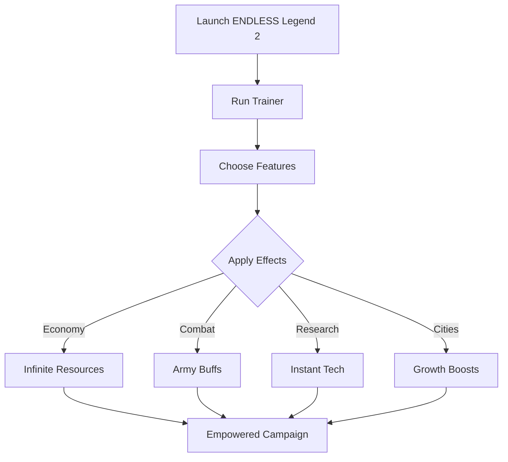

# ENDLESS Legend 2 Trainer

The **ENDLESS Legend 2 Trainer** is a powerful companion tool built for players who want to bend the rules of strategy. With real-time toggles and customizable settings, you can instantly boost your empire, armies, and research speed without tedious grinding.

Perfect for experimenting with mechanics, fast-tracking campaigns, or simply enjoying ENDLESS Legend 2 in a more relaxed way, this Trainer gives you complete control over how you play.

---

## 🌍 Overview

Strategy games often demand patience and resource juggling. The ENDLESS Legend 2 Trainer removes these limitations by giving you hotkey-driven commands that work instantly during gameplay. No restarts, no complex mods—just seamless adjustments whenever you need them.

---

## ⚡ Features

* **Infinite Resources** – Max out Dust, Influence, and strategic materials.
* **Army Buffs** – Enable God Mode, one-hit kills, or unlimited movement points.
* **Fast Research** – Skip tech waiting times with instant unlocks.
* **City Growth Modifiers** – Boost population and building speed.
* **Custom Hotkeys** – Assign features to your preferred key layout.
* **Toggle Anytime** – Enable or disable effects live during gameplay.

---

## 🖥 Compatibility

| Platform   | Status      | Notes                              |
| ---------- | ----------- | ---------------------------------- |
| Windows 10 | ✅ Supported | Stable with DX11                   |
| Windows 11 | ✅ Supported | Optimized for DX12 builds          |
| Linux      | ⚠️ Partial  | Proton/Wine required for execution |

[!IMPORTANT]
Always run the Trainer with **administrator privileges** to ensure smooth integration with ENDLESS Legend 2.

---

## 📊 Trainer Workflow

---

## 🚀 Final Thoughts

The **ENDLESS Legend 2 Trainer** is the ultimate shortcut for players who want to shape campaigns their way. Whether it’s infinite Dust, unbreakable armies, or instant research, this tool puts the fate of Auriga directly in your hands.

